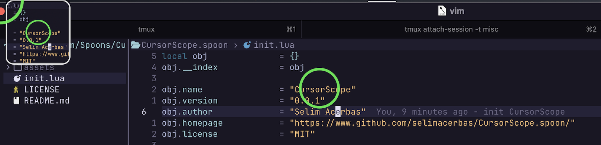

# CursorScope.spoon

High-visibility **cursor highlight** + optional live **magnifier scope** for [Hammerspoon](https://www.hammerspoon.org/).

Follows your pointer across multiple displays, shows a fixed, tasteful Menu Bar icon while running, and is easy to configure.

> You might also interested in this tool as well [KeyCaster](https://github.com/selimacerbas/KeyCaster.spoon)
---

## Screenshots



---

## Features

* 🔍 **Magnifier scope** docked to a corner of the active display (circle or rounded rectangle)
* 🎯 **Cursor highlight**: ring, crosshair, or dot, with a click-flash color
* 🖥️ **Multi-display aware**: scope streams from whatever display the cursor is on
* 🧭 **Menu Bar**: fixed cursor-style icon; click → “Exit CursorScope”
* ⌨️ **Hotkeys**: start/stop/toggle
* ⚙️ **Clean config** grouped as `global`, `cursor`, and `scope`
* 💤 Optional mode: highlight only (scope disabled)

---

## Requirements

* **macOS** 10.15+ (Big Sur or newer recommended)
* **Hammerspoon** 0.9.100+
* **Permissions**

  * *Accessibility* (for event taps / hotkeys)
  * *Screen Recording* (for the scope capture). If the scope is black/blank, enable this for **Hammerspoon** in **System Settings → Privacy & Security → Screen Recording**.

---

## Install

### Option A — Download release (recommended)

1. Download `CursorScope.spoon.zip` from your repo’s **Releases**.
2. Unzip and move `CursorScope.spoon` into:

   ```
   ~/.hammerspoon/Spoons/
   ```
3. Add the **Quick start** snippet below to your `~/.hammerspoon/init.lua`.
4. Reload Hammerspoon (menu icon → **Reload Config**).

### Option B — Git clone (for development)

```bash
mkdir -p ~/.hammerspoon/Spoons
cd ~/.hammerspoon/Spoons
git clone https://github.com/yourname/CursorScope.spoon.git CursorScope.spoon
```

Then follow **Quick start**.

---

## Quick start

```lua
-- ~/.hammerspoon/init.lua
hs.loadSpoon("CursorScope")

spoon.CursorScope:configure({
  global = { fps = 60 },               -- smoother follow/stream
  cursor = {
    shape     = "crosshair",           -- "ring" | "crosshair" | "dot"
    lineWidth = 6,
    -- idleColor  = {red=0, green=0.6, blue=1, alpha=0.9},
    -- clickColor = {red=1, green=0,   blue=0, alpha=0.95},
    -- radius     = 28,
  },
  scope  = {
    enabled  = true,                   -- turn scope on/off
    shape    = "circle",               -- "rectangle" | "circle"
    size     = 240,                    -- px
    zoom     = 2.5,                    -- 1.5–4.0 recommended
    position = { corner="topLeft", x=24, y=24 },
    -- cornerRadius = 12,              -- rectangle only
    -- borderWidth  = 2,
    -- borderColor  = {red=1, green=1, blue=1, alpha=0.9},
    -- background   = {red=0, green=0, blue=0, alpha=0.25},
  },
})

-- Hotkeys (defaults shown)
spoon.CursorScope:bindHotkeys({
  start  = {{"ctrl","alt","cmd"}, "Z"},
  stop   = {{"ctrl","alt","cmd"}, "U"},
  -- toggle = {{"ctrl","alt","cmd"}, "T"},
})

-- Optional: start immediately after reload
-- spoon.CursorScope:start()
```

**Menu Bar:** while running, a cursor-style icon appears; click it → **Exit CursorScope**.

---

## Configuration

All options are set in a single call:

```lua
spoon.CursorScope:configure({
  global = { ... },
  cursor = { ... },
  scope  = { ... },
})
```

### `global`

| Key   | Type   | Default | Description                                                                        |
| ----- | ------ | ------: | ---------------------------------------------------------------------------------- |
| `fps` | number |    `30` | Render/update rate (highlight follow + scope stream). Higher = smoother, more CPU. |

### `cursor`

| Key          | Type                             |                                 Default | Description                                                                                    |
| ------------ | -------------------------------- | --------------------------------------: | ---------------------------------------------------------------------------------------------- |
| `shape`      | `"ring" \| "crosshair" \| "dot"` |                                `"ring"` | Highlight style.                                                                               |
| `idleColor`  | color table                      | `{red=0, green=0.6, blue=1, alpha=0.9}` | Color while idle.                                                                              |
| `clickColor` | color table                      |  `{red=1, green=0, blue=0, alpha=0.95}` | Flash color on mouse down.                                                                     |
| `radius`     | number                           |                                    `28` | Ring/dot size & crosshair arm length.                                                          |
| `lineWidth`  | number                           |                                     `4` | Crosshair thickness (also ring stroke). Use an **even** number (4/6/8) for crisp Retina lines. |

> **Color format:** `{red=0..1, green=0..1, blue=0..1, alpha=0..1}`.

### `scope`

| Key               | Type                                                       |                                Default | Description                                    |
| ----------------- | ---------------------------------------------------------- | -------------------------------------: | ---------------------------------------------- |
| `enabled`         | boolean                                                    |                                 `true` | Show/hide the scope entirely.                  |
| `size`            | number                                                     |                                  `220` | Scope window size (square, in px).             |
| `zoom`            | number                                                     |                                  `2.0` | Magnification (try 1.5–4.0).                   |
| `shape`           | `"rectangle" \| "circle"`                                  |                          `"rectangle"` | Scope window shape.                            |
| `cornerRadius`    | number                                                     |                                   `12` | Rounded corners (rectangle only).              |
| `borderWidth`     | number                                                     |                                    `2` | Scope border thickness.                        |
| `borderColor`     | color table                                                |  `{red=1, green=1, blue=1, alpha=0.9}` | Border color.                                  |
| `background`      | color table                                                | `{red=0, green=0, blue=0, alpha=0.25}` | Background/dimming behind the image.           |
| `position.corner` | `"topLeft" \| "topRight" \| "bottomLeft" \| "bottomRight"` |                        `"bottomRight"` | Corner of the **active display**.              |
| `position.x`      | number                                                     |                                   `20` | Horizontal offset from the chosen corner (px). |
| `position.y`      | number                                                     |                                   `80` | Vertical offset from the chosen corner (px).   |

**Multi-display behavior:** The scope anchors to the configured corner of whichever display the cursor is currently on and streams that display’s pixels.

---

## Hotkeys

Defaults:

* **Start:** `⌃⌥⌘ Z`
* **Stop:**  `⌃⌥⌘ U`

Override (any you omit keep the default):

```lua
spoon.CursorScope:bindHotkeys({
  start  = {{"ctrl","alt","cmd"}, "S"},
  stop   = {{"ctrl","alt","cmd"}, "X"},
  toggle = {{"ctrl","alt","cmd"}, "T"},
})
```

---

## API

```lua
spoon.CursorScope:start()          -- enable highlight/scope; show Menu Bar icon
spoon.CursorScope:stop()           -- disable and remove Menu Bar icon
spoon.CursorScope:toggle()         -- start/stop
spoon.CursorScope:configure(tbl)   -- apply configuration (see above)
spoon.CursorScope:setScopeEnabled(true_or_false) -- quick scope toggle
```

> The Menu Bar icon is fixed and non-configurable by design. It shows only while running and includes **Exit CursorScope**.

---

## Troubleshooting

* **Scope is black/blank**
  Grant **Screen Recording** permission to Hammerspoon (System Settings → Privacy & Security → Screen Recording).

* **No Menu Bar icon**
  The icon appears **only while running** (start with your hotkey or call `spoon.CursorScope:start()` in your init file).

* **Crosshair looks blurry**
  Use an **even** `cursor.lineWidth` (e.g., 4, 6, 8) for pixel-aligned arms on Retina displays.

* **High CPU**
  Lower `global.fps` (e.g., 30) and/or `scope.zoom`. Bigger `scope.size` also costs more.

---

## Contributing

PRs and issues are welcome!

* Keep the config grouped (`global`, `cursor`, `scope`).
* The Menu Bar icon is intentionally **not user-configurable**.
* Maintain rock-solid cross-display behavior (`absolute ↔ local` conversions for snapshots).
* Include a short demo GIF for visual features when possible.

**Dev setup:**

```bash
git clone https://github.com/yourname/CursorScope.spoon.git
ln -s "$(pwd)/CursorScope.spoon" ~/.hammerspoon/Spoons/CursorScope.spoon
# Edit init.lua, then in Hammerspoon: Reload Config
```

---

## Roadmap

* Optional drop shadow / glow for the scope
* Crosshair center gap & adjustable arm lengths
* Quick Menu Bar toggles: “Toggle Scope”, “Restart”
* Presets/profiles (presenting vs. recording)

---

## License

MIT © Your Name — see [`LICENSE`](LICENSE)

---

### Credits

Built with ❤️ on top of [Hammerspoon](https://www.hammerspoon.org/).
