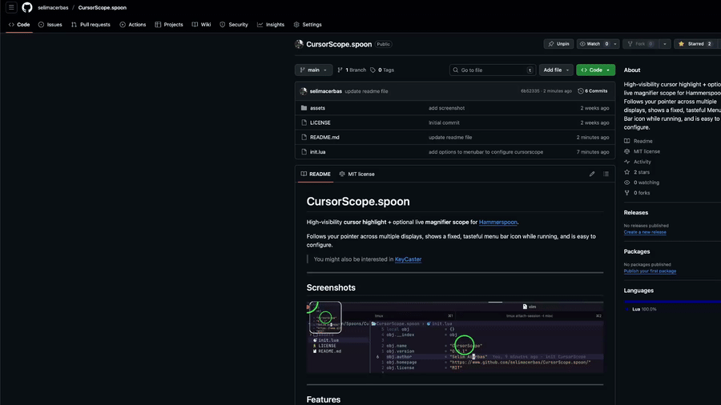
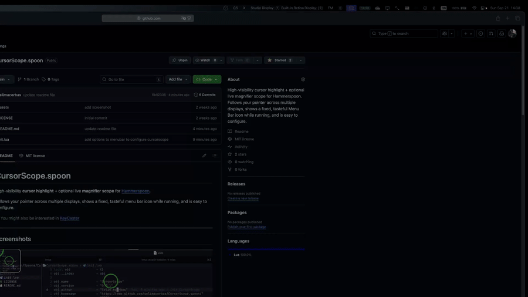

# CursorScope.spoon

High-visibility **cursor highlight** + optional live **magnifier scope** for [Hammerspoon](https://www.hammerspoon.org/).

Follows your pointer across multiple displays, shows a fixed, tasteful menu bar icon while running, and is easy to configure.

> You might also be interested in [KeyCaster](https://github.com/selimacerbas/KeyCaster.spoon), [FocusMode](https://github.com/selimacerbas/FocusMode.spoon)

---

## 🎥 Demo






## Features

* 🔍 **Draggable magnifier scope** (circle or rounded rectangle). Hold **⌘ + ⌥** and drag the scope to move it. Position is **remembered per display**.
* 🎯 **Cursor highlight**: ring, crosshair, or dot—with click flash.
* 🖥️ **Multi-display aware**: scope always samples from the display under your pointer.
* 🧭 **Menu bar controls**: toggle scope, switch scope/cursor shape, set **Zoom**, **Size**, and **FPS** (presets + custom).
* ⌨️ **Hotkeys**: start/stop/toggle (configurable).
* ⚙️ **Clean config** grouped as `global`, `cursor`, and `scope`.
* 💤 **Highlight-only** mode (scope disabled).
* 🌀 **No infinite tunnel**: when the capture area would overlap the scope, the scope briefly **freezes** its last image to avoid recursion.

---

## Requirements

* **macOS** 10.15+ (Big Sur or newer recommended)
* **Hammerspoon** 0.9.100+
* **Permissions**

  * **Accessibility** (for event taps / hotkeys and drag gesture)
  * **Screen Recording** (for scope capture). If the scope is black/blank, enable this for **Hammerspoon** in **System Settings → Privacy & Security → Screen Recording**

---

## Install

### Option A — Download release (recommended)

1. Download `CursorScope.spoon.zip` from the repo’s **Releases**.
2. Unzip and move `CursorScope.spoon` into:

   ```
   ~/.hammerspoon/Spoons/
   ```
3. Add the **Quick start** snippet below to your `~/.hammerspoon/init.lua`.
4. Reload Hammerspoon (menu bar icon → **Reload Config**).

### Option B — Git clone (for development)

```bash
mkdir -p ~/.hammerspoon/Spoons
cd ~/.hammerspoon/Spoons
git clone https://github.com/selimacerbas/CursorScope.spoon.git CursorScope.spoon
```

Then follow **Quick start**.

---

## Quick start

```lua
-- ~/.hammerspoon/init.lua
hs.loadSpoon("CursorScope")

spoon.CursorScope:configure({
  global = { fps = 60 },               -- smoother follow/stream
  cursor = {
    shape     = "crosshair",           -- "ring" | "crosshair" | "dot"
    lineWidth = 6,
    -- idleColor  = {red=0, green=0.6, blue=1, alpha=0.9},
    -- clickColor = {red=1, green=0,   blue=0, alpha=0.95},
    -- radius     = 28,
  },
  scope  = {
    enabled  = true,                   -- turn scope on/off
    shape    = "circle",               -- "rectangle" | "circle"
    size     = 240,                    -- px
    zoom     = 2.5,                    -- 1.5–4.0 recommended
    -- topLeft  = {x=1200, y=100},     -- optional absolute position; per-screen memory thereafter
    -- cornerRadius = 12,              -- rectangle only
    -- borderWidth  = 2,
    -- borderColor  = {red=1, green=1, blue=1, alpha=0.9},
    -- background   = {red=0, green=0, blue=0, alpha=0.25},
  },
})

-- Hotkeys (defaults shown)
spoon.CursorScope:bindHotkeys({
  start  = {{"ctrl","alt","cmd"}, "Z"},
  stop   = {{"ctrl","alt","cmd"}, "U"},
  -- toggle = {{"ctrl","alt","cmd"}, "T"},
})

-- Optional: start immediately after reload
-- spoon.CursorScope:start()
```

**Menu bar:** while running, a cursor-style icon appears. Click for a menu with Scope toggle, shapes, Zoom, Size, FPS, Start/Stop, Exit.

---

## Menubar actions

* **Scope**: Enabled/Disabled (toggle, with checkmark)
* **Scope Shape**: Rectangle • Circle
* **Cursor Shape**: Ring • Crosshair • Dot
* **FPS**: 15 / 24 / 30 / 45 / 60 / **Custom…** (restarts stream timer if changed)
* **Zoom**: 1.5× / 2.0× / 3.0× / 4.0× / **Custom…**
* **Size**: Small (160) / Medium (220) / Large (320) / **Custom…** (rebuilds scope at new size)
* **Start/Stop**, **Exit CursorScope**

---

## Gestures

* **Move the scope**: hold **⌘ + ⌥**, click inside the scope, and drag.

  * The border flashes **yellow** during drag.
  * Position is clamped to the current display and **remembered per display**.
* **Cursor highlight** is click-through, so it won’t intercept drags/clicks.

---

## Configuration reference

All options are set in a single call:

```lua
spoon.CursorScope:configure({
  global = { ... },
  cursor = { ... },
  scope  = { ... },
})
```

### `global`

| Key   | Type   | Default | Description                                                                        |
| ----- | ------ | ------: | ---------------------------------------------------------------------------------- |
| `fps` | number |    `30` | Render/update rate (highlight follow + scope stream). Higher = smoother, more CPU. |

### `cursor`

| Key          | Type                             |                                 Default | Description                                                                                    |
| ------------ | -------------------------------- | --------------------------------------: | ---------------------------------------------------------------------------------------------- |
| `shape`      | `"ring" \| "crosshair" \| "dot"` |                                `"ring"` | Highlight style.                                                                               |
| `idleColor`  | color table                      | `{red=0, green=0.6, blue=1, alpha=0.9}` | Color while idle.                                                                              |
| `clickColor` | color table                      |  `{red=1, green=0, blue=0, alpha=0.95}` | Flash color on mouse down.                                                                     |
| `radius`     | number                           |                                    `28` | Ring/dot size & crosshair arm length.                                                          |
| `lineWidth`  | number                           |                                     `4` | Crosshair thickness (also ring stroke). Use an **even** number (4/6/8) for crisp Retina lines. |

> **Color format:** `{red=0..1, green=0..1, blue=0..1, alpha=0..1}`.

### `scope`

| Key            | Type                      |                                Default | Description                                         |
| -------------- | ------------------------- | -------------------------------------: | --------------------------------------------------- |
| `enabled`      | boolean                   |                                 `true` | Show/hide the scope entirely.                       |
| `size`         | number                    |                                  `220` | Scope window size (square, in px).                  |
| `zoom`         | number                    |                                  `2.0` | Magnification (try 1.5–4.0).                        |
| `shape`        | `"rectangle" \| "circle"` |                          `"rectangle"` | Scope window shape.                                 |
| `cornerRadius` | number                    |                                   `12` | Rounded corners (rectangle only).                   |
| `borderWidth`  | number                    |                                    `2` | Scope border thickness.                             |
| `borderColor`  | color table               |  `{red=1, green=1, blue=1, alpha=0.9}` | Border color.                                       |
| `background`   | color table               | `{red=0, green=0, blue=0, alpha=0.25}` | Background/dimming behind the image.                |
| `topLeft`      | `{x:number,y:number}`     |                                  `nil` | Optional absolute top-left; per-screen memory wins. |

**Multi-display behavior:** Each display remembers its own position for the scope. On a display you’ve never used, the scope maps from your last position relatively; if there’s no history, it defaults near bottom-right.

---

## Hotkeys

Defaults:

* **Start:** `⌃⌥⌘ Z`
* **Stop:**  `⌃⌥⌘ U`

Override (any you omit keep the default):

```lua
spoon.CursorScope:bindHotkeys({
  start  = {{"ctrl","alt","cmd"}, "S"},
  stop   = {{"ctrl","alt","cmd"}, "X"},
  toggle = {{"ctrl","alt","cmd"}, "T"},
})
```

---

## API

```lua
spoon.CursorScope:start()                          -- enable highlight/scope; show menu bar icon
spoon.CursorScope:stop()                           -- disable and remove menu bar icon
spoon.CursorScope:toggle()                         -- start/stop
spoon.CursorScope:configure(tbl)                   -- apply configuration (see above)
spoon.CursorScope:setScopeEnabled(true_or_false)   -- quick scope toggle
spoon.CursorScope:setScopeTopLeft(x, y)            -- set absolute position (current screen)
```

> The menu bar icon is fixed and non-configurable by design. It shows only while running.

---

## Troubleshooting

* **Scope is black/blank** → Grant **Screen Recording** permission to Hammerspoon (System Settings → Privacy & Security → Screen Recording).
* **Drag doesn’t work** → Ensure **Accessibility** permission is granted to Hammerspoon (System Settings → Privacy & Security → Accessibility). Hold **⌘ + ⌥** while you click and drag inside the scope.
* **Crosshair looks blurry** → Use an **even** `cursor.lineWidth` (e.g., 4, 6, 8) for pixel-aligned arms on Retina displays.
* **High CPU** → Lower `global.fps` (e.g., 30) and/or `scope.zoom`. Bigger `scope.size` also costs more.
* **“Infinite tunnel” effect** → By design, the scope **freezes** its image when the capture area would include the scope window. Move the pointer off the scope to resume updates.

---

## Dev setup

```bash
git clone https://github.com/selimacerbas/CursorScope.spoon.git
ln -s "$(pwd)/CursorScope.spoon" ~/.hammerspoon/Spoons/CursorScope.spoon
# Edit init.lua, then in Hammerspoon: Reload Config
```

---

## License

MIT © Selim Acerbas — see [`LICENSE`](LICENSE)

---

### Credits

Built with ❤️ on top of [Hammerspoon](https://www.hammerspoon.org/).
