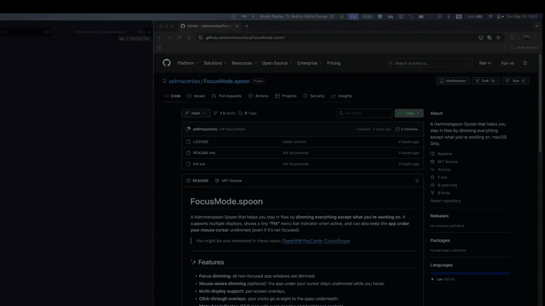

# FocusMode.spoon

A Hammerspoon Spoon that helps you stay in flow by **dimming everything except what you’re working on**. It supports multiple displays, shows a tiny **“FM”** menu bar indicator when active, and can also keep the **app under your mouse cursor** undimmed (even if it’s not focused).

> You might be also interested in these repos;
> [PaperWM](https://github.com/mogenson/PaperWM.spoon)
> [KeyCaster](https://github.com/selimacerbas/KeyCaster.spoon)
> [CursorScope](https://github.com/selimacerbas/CursorScope.spoon)
---

## 🎥 Demo

### App Focus


### Mouse Dimming


---

## ✨ Features

* **Focus dimming**: all non-focused app windows are dimmed.
* **Mouse-aware dimming** *(optional)*: the app under your cursor stays undimmed while you hover.
* **Multi-display support**: per-screen overlays.
* **Click-through overlays**: your clicks go straight to the apps underneath.
* **Menu bar indicator**: "FM" icon with quick toggles and brightness controls.
* **Screenshot awareness**: automatically hides overlays during screenshots (⌘⇧3/4/5/6).
* **Space-change handling**: immediate redraw when switching Spaces — no stale holes.
* **PaperWM-friendly**: debounced redraws for smooth transitions when tiling or switching.

---

## 📦 Requirements

* **macOS** with [Hammerspoon](https://www.hammerspoon.org/) installed.
* Works best with a **recent Hammerspoon build**. The Spoon contains fallbacks for older APIs, but if you see deprecation warnings, please update Hammerspoon.

---

## 🔧 Install

### Manual (recommended for first-time use)

1. Create the Spoon folder:

   ```bash
   mkdir -p ~/.hammerspoon/Spoons/FocusMode.spoon
   ```
2. Copy `init.lua` from this repo into:

   ```
   ~/.hammerspoon/Spoons/FocusMode.spoon/init.lua
   ```

### Via SpoonInstall (once it’s published)

```lua
hs.loadSpoon("SpoonInstall")
spoon.SpoonInstall:andUse("FocusMode", { start = true })
```

---

## 🚀 Quick Start

In your `~/.hammerspoon/init.lua`:

```lua
hs.loadSpoon("FocusMode")

-- Optional: tweak settings before start
-- spoon.FocusMode.dimAlpha = 0.45
-- spoon.FocusMode.mouseDim = true
-- spoon.FocusMode.windowCornerRadius = 6
-- spoon.FocusMode.eventSettleDelay = 0.03 -- smoother with tilers
-- spoon.FocusMode.perWindowFocus = true   -- only undim the focused window
-- spoon.FocusMode.fadeOutDuration = 0.3   -- smooth fade when losing focus
-- spoon.FocusMode.dimDelay = 1.0          -- 1s grace before dimming starts

-- Optional: custom hotkeys
-- spoon.FocusMode:bindHotkeys({
--   start = { {"ctrl","alt","cmd"}, "I" },
--   stop  = { {"ctrl","alt","cmd"}, "O" },
-- })

-- Start (you can also use the hotkey)
spoon.FocusMode:start()
```

**Default hotkeys**

* Start: **Ctrl + Option (Alt) + Command + I**
* Stop: **Ctrl + Option (Alt) + Command + O**

**Menu bar**

* Shows **FM** when running.
* Toggle **Mouse Dimming**.
* Adjust brightness with **Brighter (+)** / **Dimmer (−)**.
* Stop FocusMode.

---

## ⚙️ Configuration Options

Set these before `:start()` in `init.lua`.

| Option                   | Type               | Default  | What it does                                                                          |
| ------------------------ | ------------------ | -------- | ------------------------------------------------------------------------------------- |
| `dimAlpha`               | `number` (0..1)    | `0.45`   | Darkness of the dim overlay (higher = darker).                                        |
| `windowCornerRadius`     | `number`           | `6`      | Rounded corners for the undimmed holes. Set `0` for sharp edges.                      |
| `mouseDim`               | `boolean`          | `true`   | If `true`, the entire app under your cursor stays undimmed (even when not focused).   |
| `mouseUpdateThrottle`    | `number` (seconds) | `0.05`   | Throttle for mouse move handling; lower is more responsive, higher is lighter on CPU. |
| `eventSettleDelay`       | `number` (seconds) | `0.03`   | Debounce for focus/move/resize bursts (useful with tilers like PaperWM).              |
| `perWindowFocus`         | `boolean`          | `false`  | If `true`, only the focused window is undimmed (not all windows of that app).         |
| `fadeOutDuration`        | `number` (seconds) | `0.3`    | Duration for departing windows to fade back into the dim. Set `0` for instant.        |
| `dimDelay`               | `number` (seconds) | `0.0`    | Grace period before fading starts. Switch back within this time for instant undim.    |
| `screenshotAware`               | `boolean`          | `true`   | Temporarily hide overlays when taking screenshots.                                    |
| `screenshotSuspendSecondsShort` | `number` (seconds) | `3.0`    | How long to hide overlays for ⌘⇧3 / ⌘⇧4 captures.                                  |
| `screenshotSuspendSecondsUI`    | `number` (seconds) | `12.0`   | How long to hide overlays for ⌘⇧5 toolbar mode.                                     |
| `autoBindDefaultHotkeys` | `boolean`          | `true`   | Whether to bind default start/stop hotkeys automatically.                             |
| `defaultHotkeys`         | `table`            | see code | Change the default hotkeys. Prefer `:bindHotkeys()` instead.                          |

---

## 🧩 API (public)

* `spoon.FocusMode:start()` – Start overlays and watchers.
* `spoon.FocusMode:stop()` – Stop and clean up.
* `spoon.FocusMode:toggle()` – Toggle running state.
* `spoon.FocusMode:bindHotkeys({ start = {...}, stop = {...} })` – Rebind hotkeys.

> The Spoon is designed to be **click-through** and **non-activating**. Overlays join all Spaces so the shade follows you as you move.

---

## 🧱 How it works (high level)

* For each screen, FocusMode renders a single transparent **canvas overlay**.
* The overlay is filled with a semi-opaque rectangle (the dim), and we “punch holes” for windows that should be visible using a compositing rule.
* Holes are created for **all windows of the focused app**; if `mouseDim = true`, holes are also added for **all windows of the app under your cursor**.
* Redraws are **debounced** (`eventSettleDelay`) to avoid flicker while window managers are shuffling frames.

---

## 🧭 PaperWM Integration (optional)

FocusMode works well with PaperWM out of the box — `eventSettleDelay` debounces rapid tiling events, the space watcher handles Space switches, and `fadeOutDuration` smooths focus transitions. No manual `_suspendFor` calls are needed.

Only cross-space operations (moving windows, switching Spaces) need wrappers because the Spaces API is asynchronous.

**Example: wrappers for moves and space switches**

```lua
local A = s.actions.actions() -- PaperWM actions table

-- Wrapper for async Spaces operations (move window, switch space)
local function wrapMove(fn)
  return function()
    fn()
    hs.timer.doAfter(0.25, A.refresh_windows)
  end
end
local function wrapSwitch(fn)
  return function()
    fn()
    hs.timer.doAfter(0.25, A.refresh_windows)
  end
end

-- Focus/swap: direct calls, no wrapper needed
nav:bind({}, "h", nil, A.focus_left,  nil, A.focus_left)
nav:bind({}, "l", nil, A.focus_right, nil, A.focus_right)
nav:bind({}, "j", nil, A.focus_down,  nil, A.focus_down)
nav:bind({}, "k", nil, A.focus_up,    nil, A.focus_up)

nav:bind({ "shift" }, "h", nil, A.swap_left,  nil, A.swap_left)
nav:bind({ "shift" }, "l", nil, A.swap_right, nil, A.swap_right)

-- Space switches and cross-space moves need the async wrapper
nav:bind({}, "1", nil, wrapSwitch(A.switch_space_1), wrapSwitch(A.switch_space_1))
nav:bind({}, "2", nil, wrapSwitch(A.switch_space_2), wrapSwitch(A.switch_space_2))
nav:bind({ "shift" }, "1", nil, wrapMove(A.move_window_1), nil, wrapMove(A.move_window_1))
nav:bind({ "shift" }, "2", nil, wrapMove(A.move_window_2), nil, wrapMove(A.move_window_2))
```

**Notes**

* Focus and swap actions (`h/j/k/l`) call PaperWM directly — no wrappers, zero latency.
* Only `wrapMove` and `wrapSwitch` add a 0.25s delayed `refresh_windows` to let Mission Control settle.
* Tune `spoon.FocusMode.eventSettleDelay` (e.g., `0.02`–`0.05`) for your machine.

---

## 📜 License

MIT

## 🙏 Credits

* The Hammerspoon community
* [PaperWM.spoon](https://github.com/mogenson/PaperWM.spoon) by @mogenson for the tiling workflow inspiration
